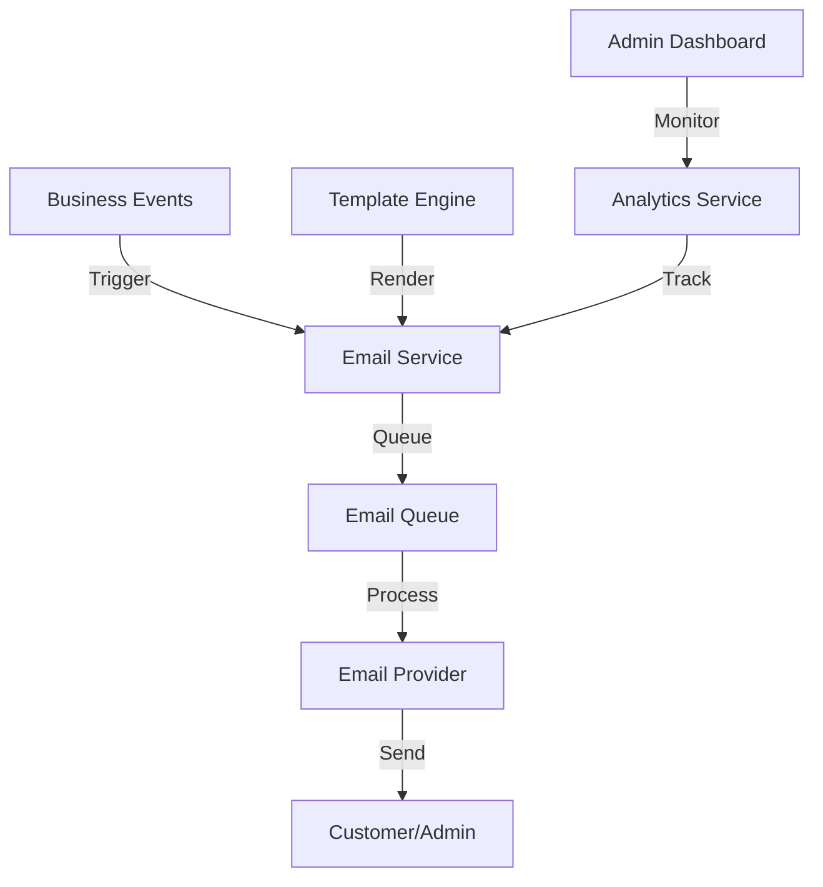
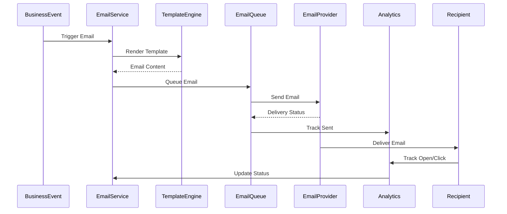

# Design Document: Email Notification System

## Overview

This design document outlines the implementation of a comprehensive email notification system for the Algeria Market e-commerce platform using the business email address `enquirees@algeriamarket.co.uk`. The system will provide reliable, scalable, and customizable email delivery for various business events including customer communications, order notifications, payment confirmations, and promotional campaigns. The design focuses on creating a modular email service that supports multiple email providers while maintaining high deliverability rates and providing comprehensive analytics, with all emails sent from the official Algeria Market business email address.

## Architecture

The email system will follow a service-oriented architecture pattern, with a dedicated email service that encapsulates all email-related operations. This approach ensures separation of concerns and uses Microsoft Graph API for Outlook Business as the sole email provider.



## Components and Interfaces

### 1. Email Service

The core component responsible for all email operations.

```go
// email/service.go
type EmailService struct {
    provider        EmailProvider
    templateEngine  TemplateEngine
    queue           EmailQueue
    analytics       EmailAnalytics
    config          *cfg.EmailConfig
}

func NewEmailService(config *cfg.EmailConfig) *EmailService {
    // Initialize email service with configuration
}

// Core email operations
func (s *EmailService) SendEmail(template string, data map[string]interface{}, recipient EmailRecipient) error
func (s *EmailService) SendBulkEmail(template string, data map[string]interface{}, recipients []EmailRecipient) error
func (s *EmailService) SendTransactionalEmail(emailType EmailType, data map[string]interface{}, recipient EmailRecipient) error
func (s *EmailService) GetEmailStatus(emailID string) (EmailStatus, error)
func (s *EmailService) RetryFailedEmail(emailID string) error
```

### 2. Email Provider Interface

Microsoft Graph API interface for Outlook Business email provider.

```go
// email/provider.go
type EmailProvider interface {
    SendEmail(email *Email) error
    SendBulkEmail(emails []*Email) error
    GetDeliveryStatus(emailID string) (DeliveryStatus, error)
    GetBounceList() ([]string, error)
    GetComplaintList() ([]string, error)
}

type OutlookProvider struct {
    client        *graph.Client
    tenantID      string
    clientID      string
    clientSecret  string
    senderEmail   string // enquirees@algeriamarket.co.uk
    senderName    string // Algeria Market
}
```

### 3. Template Engine

Component for rendering email templates with dynamic data.

```go
// email/template.go
type TemplateEngine interface {
    RenderTemplate(templateName string, data map[string]interface{}) (string, string, error)
    GetTemplateList() []string
    ReloadTemplates() error
}

type HTMLTemplateEngine struct {
    templates *template.Template
    basePath  string
}
```

### 4. Email Queue

Component for queuing and processing emails asynchronously.

```go
// email/queue.go
type EmailQueue interface {
    Enqueue(email *Email) error
    Dequeue() (*Email, error)
    MarkAsProcessed(emailID string) error
    MarkAsFailed(emailID string, error string) error
    GetFailedEmails() ([]*Email, error)
}

type RedisEmailQueue struct {
    client *redis.Client
    queue  string
}

// redis/redis.go
type RedisConfig struct {
    UpstashURL      string // UPSTASH_REDIS_REST_URL
    UpstashToken    string // UPSTASH_REDIS_REST_TOKEN
    PoolSize        int    // Default: 10
}

type RedisService struct {
    client *redis.Client
    config *RedisConfig
}

func NewRedisService(config *RedisConfig) (*RedisService, error) {
    // Parse Upstash URL to get host and port
    parsedURL, err := url.Parse(config.UpstashURL)
    if err != nil {
        return nil, fmt.Errorf("invalid Upstash URL: %w", err)
    }
    
    // Extract host and port from Upstash URL
    host := parsedURL.Hostname()
    port := parsedURL.Port()
    if port == "" {
        port = "6379" // Default Redis port
    }
    
    client := redis.NewClient(&redis.Options{
        Addr:     fmt.Sprintf("%s:%s", host, port),
        Password: config.UpstashToken,
        DB:       0, // Upstash uses single database
        PoolSize: config.PoolSize,
        TLSConfig: &tls.Config{
            InsecureSkipVerify: false,
        },
    })
    
    // Test connection
    _, err = client.Ping().Result()
    if err != nil {
        return nil, fmt.Errorf("failed to connect to Upstash Redis: %w", err)
    }
    
    return &RedisService{
        client: client,
        config: config,
    }, nil
}

func (r *RedisService) GetClient() *redis.Client {
    return r.client
}

func (r *RedisService) Close() error {
    return r.client.Close()
}
```

### 5. Email Analytics

Component for tracking email performance and delivery metrics.

```go
// email/analytics.go
type EmailAnalytics interface {
    TrackEmailSent(email *Email) error
    TrackEmailDelivered(emailID string) error
    TrackEmailOpened(emailID string) error
    TrackEmailClicked(emailID string, link string) error
    TrackEmailBounced(emailID string, reason string) error
    GetEmailMetrics(timeRange TimeRange) (*EmailMetrics, error)
}

type EmailMetrics struct {
    SentCount      int     `json:"sent_count"`
    DeliveredCount int     `json:"delivered_count"`
    OpenedCount    int     `json:"opened_count"`
    ClickedCount   int     `json:"clicked_count"`
    BouncedCount   int     `json:"bounced_count"`
    DeliveryRate   float64 `json:"delivery_rate"`
    OpenRate       float64 `json:"open_rate"`
    ClickRate      float64 `json:"click_rate"`
}
```

### 6. Email Models

Data structures for email processing.

```go
// models/email.go
type Email struct {
    gorm.Model
    Type            EmailType           `json:"type"`
    Template        string              `json:"template"`
    Recipient       EmailRecipient      `json:"recipient"`
    SenderEmail     string              `json:"sender_email" gorm:"default:'enquirees@algeriamarket.co.uk'"`
    SenderName      string              `json:"sender_name" gorm:"default:'Algeria Market'"`
    Subject         string              `json:"subject"`
    HTMLContent     string              `json:"html_content"`
    TextContent     string              `json:"text_content"`
    Status          EmailStatus         `json:"status"`
    ProviderID      string              `json:"provider_id"`
    SentAt          *time.Time          `json:"sent_at"`
    DeliveredAt     *time.Time          `json:"delivered_at"`
    OpenedAt        *time.Time          `json:"opened_at"`
    ClickedAt       *time.Time          `json:"clicked_at"`
    BouncedAt       *time.Time          `json:"bounced_at"`
    BounceReason    string              `json:"bounce_reason"`
    RetryCount      int                 `json:"retry_count"`
    Metadata        JSON                `json:"metadata"`
}

type EmailRecipient struct {
    Email     string `json:"email"`
    Name      string `json:"name"`
    UserID    *uint  `json:"user_id"`
    User      *User  `json:"user,omitempty"`
}

type EmailType string

const (
    EmailTypePasswordReset     EmailType = "password_reset"
    EmailTypeWelcome          EmailType = "welcome"
    EmailTypeOrderConfirmation EmailType = "order_confirmation"
    EmailTypeOrderStatusUpdate EmailType = "order_status_update"
    EmailTypePaymentSuccess   EmailType = "payment_success"
    EmailTypePaymentFailed    EmailType = "payment_failed"
    EmailTypePromotional      EmailType = "promotional"
    EmailTypeCartRecovery     EmailType = "cart_recovery"
    EmailTypeSecurityAlert    EmailType = "security_alert"
    EmailTypeAdminNotification EmailType = "admin_notification"
)

type EmailStatus string

const (
    EmailStatusPending   EmailStatus = "pending"
    EmailStatusSent      EmailStatus = "sent"
    EmailStatusDelivered EmailStatus = "delivered"
    EmailStatusOpened    EmailStatus = "opened"
    EmailStatusClicked   EmailStatus = "clicked"
    EmailStatusBounced   EmailStatus = "bounced"
    EmailStatusFailed    EmailStatus = "failed"
)
```

## Email Configuration

### Email Service Configuration

Configuration for Microsoft Graph API and Outlook Business email:

```go
// Addition to cfg/config.go
type EmailConfig struct {
    Provider        string // "outlook"
    SenderEmail     string // enquirees@algeriamarket.co.uk
    SenderName      string // Algeria Market
}

// Outlook Business specific configuration
type OutlookConfig struct {
    TenantID        string
    ClientID         string
    ClientSecret     string
    SenderEmail      string // enquirees@algeriamarket.co.uk
    SenderName       string // Algeria Market
}

// Redis configuration for email queue (Upstash)
type RedisConfig struct {
    UpstashURL      string // UPSTASH_REDIS_REST_URL
    UpstashToken    string // UPSTASH_REDIS_REST_TOKEN
    PoolSize        int    // Default: 10
}

// Update AppConfig
type AppConfig struct {
    // Existing fields...
    
    // Email configuration
    Email EmailConfig
    Outlook OutlookConfig
    Redis RedisConfig
}
```

### Default Sender Configuration

All emails will be sent from the official Algeria Market business email:

```go
const (
    DefaultSenderEmail = "enquirees@algeriamarket.co.uk"
    DefaultSenderName  = "Algeria Market"
)
```

### Environment Variables for Upstash Redis

The following environment variables should be set for Upstash Redis:

```bash
# Upstash Redis Configuration
UPSTASH_REDIS_REST_URL=redis://your-instance.upstash.io:port
UPSTASH_REDIS_REST_TOKEN=your-upstash-token
REDIS_POOL_SIZE=10
```

## Email Templates

### Template Structure

Email templates will be stored as HTML files with embedded Go template syntax:

```html
<!-- templates/emails/password_reset.html -->
<!DOCTYPE html>
<html>
<head>
    <meta charset="utf-8">
    <title>Password Reset</title>
</head>
<body>
    <div class="email-container">
        <h1>Password Reset Request</h1>
        <p>Hello {{.UserName}},</p>
        <p>You have requested to reset your password. Click the link below to proceed:</p>
        <a href="{{.ResetLink}}" class="button">Reset Password</a>
        <p>This link will expire in {{.ExpiryTime}} hours.</p>
        <p>If you didn't request this, please ignore this email.</p>
    </div>
</body>
</html>
```

### Template Data Structure

```go
// email/templates.go
type PasswordResetData struct {
    UserName    string `json:"user_name"`
    ResetLink   string `json:"reset_link"`
    ExpiryTime  int    `json:"expiry_time"`
}

type OrderConfirmationData struct {
    OrderNumber string    `json:"order_number"`
    OrderDate   time.Time `json:"order_date"`
    TotalAmount float64   `json:"total_amount"`
    Items       []OrderItem `json:"items"`
    ShippingAddress Address `json:"shipping_address"`
}
```

## Email Flow

### Transactional Email Flow

1. Business event triggers email sending
2. Email service creates email record
3. Template engine renders email content
4. Email is queued for delivery
5. Email provider sends the email
6. Analytics service tracks delivery status
7. Recipient receives and interacts with email
8. Analytics service tracks interactions



### Bulk Email Flow

1. Marketing campaign is created
2. Email service identifies target recipients
3. Emails are rendered in batches
4. Bulk emails are queued for delivery
5. Email provider processes bulk delivery
6. Analytics service tracks bulk delivery metrics

## Email Types and Triggers

### Customer Emails

1. **Password Reset**
   - Trigger: User requests password reset
   - Template: `password_reset.html`
   - Data: Reset link, expiry time

2. **Welcome Email**
   - Trigger: User completes registration
   - Template: `welcome.html`
   - Data: User name, activation link

3. **Order Confirmation**
   - Trigger: Order is successfully placed
   - Template: `order_confirmation.html`
   - Data: Order details, items, shipping info

4. **Order Status Update**
   - Trigger: Order status changes
   - Template: `order_status_update.html`
   - Data: New status, tracking info

5. **Payment Success**
   - Trigger: Payment is completed
   - Template: `payment_success.html`
   - Data: Payment details, order summary

### Admin Emails

1. **New Order Notification**
   - Trigger: New order is placed
   - Template: `admin_new_order.html`
   - Data: Order details, customer info

2. **Payment Alert**
   - Trigger: Payment fails or is disputed
   - Template: `admin_payment_alert.html`
   - Data: Payment details, error info

3. **Low Stock Alert**
   - Trigger: Inventory falls below threshold
   - Template: `admin_low_stock.html`
   - Data: Product details, current stock

### Marketing Emails

1. **Promotional Campaign**
   - Trigger: Marketing campaign is launched
   - Template: `promotional.html`
   - Data: Campaign details, offers

2. **Cart Recovery**
   - Trigger: Cart abandonment after timeout
   - Template: `cart_recovery.html`
   - Data: Cart items, discount offer

3. **Re-engagement**
   - Trigger: Customer inactivity period
   - Template: `re_engagement.html`
   - Data: Personalized content, offers

## Error Handling

### Email Delivery Errors

1. **Temporary Failures**
   - Implement exponential backoff retry
   - Log error details for debugging
   - Queue for retry with increasing delays

2. **Permanent Failures**
   - Mark email as permanently failed
   - Update recipient status (bounced)
   - Remove from future email lists

3. **Provider Failures**
   - Implement circuit breaker pattern for Microsoft Graph API
   - Alert administrators of service issues
   - Queue emails for retry when service is restored

### Template Errors

1. **Missing Templates**
   - Use fallback template
   - Log template missing error
   - Alert developers of missing templates

2. **Template Rendering Errors**
   - Use error template
   - Log rendering error details
   - Provide debugging information

## Security Considerations

### Email Content Security

1. **Template Injection Prevention**
   - Sanitize all template data
   - Use safe template functions
   - Validate template variables

2. **Link Security**
   - Sign all email links
   - Implement link expiration
   - Track link clicks for security

3. **Data Protection**
   - Encrypt sensitive email data
   - Implement data retention policies
   - Comply with privacy regulations

### Authentication and Authorization

1. **Email Service Access**
   - Secure API keys and credentials
   - Implement rate limiting
   - Monitor for abuse

2. **Template Management**
   - Restrict template modification access
   - Audit template changes
   - Version control for templates

## Performance Optimization

### Email Delivery Optimization

1. **Batch Processing**
   - Process emails in batches
   - Implement connection pooling
   - Use async processing

2. **Template Caching**
   - Cache compiled templates
   - Implement template preloading
   - Use CDN for static assets

3. **Queue Management**
   - Implement priority queues
   - Use separate queues for different email types
   - Implement queue monitoring

### Analytics Optimization

1. **Data Storage**
   - Use time-series databases for metrics
   - Implement data aggregation
   - Archive old analytics data

2. **Real-time Monitoring**
   - Implement real-time dashboards
   - Use WebSocket for live updates
   - Set up automated alerts

## Monitoring and Analytics

### Key Metrics

1. **Delivery Metrics**
   - Sent count
   - Delivered count
   - Bounce rate
   - Delivery rate

2. **Engagement Metrics**
   - Open rate
   - Click-through rate
   - Unsubscribe rate
   - Spam complaint rate

3. **Performance Metrics**
   - Send time
   - Delivery time
   - Queue processing time
   - Error rates

### Monitoring Dashboard

1. **Real-time Metrics**
   - Current queue size
   - Emails sent per minute
   - Error rates
   - Provider status

2. **Historical Analytics**
   - Email performance trends
   - Template effectiveness
   - Recipient engagement
   - Campaign success rates

## Implementation Considerations

### Phased Rollout

1. **Phase 1: Core Email Types**
   - Password reset emails
   - Order confirmation emails
   - Basic admin notifications

2. **Phase 2: Advanced Features**
   - Marketing emails
   - Analytics dashboard
   - Template management

3. **Phase 3: Optimization**
   - Performance tuning
   - Advanced analytics
   - A/B testing

### Integration Points

1. **Existing System Integration**
   - User management system
   - Order management system
   - Payment system
   - Inventory system

2. **Third-party Integrations**
   - Microsoft Graph API for Outlook Business
   - Analytics platforms
   - Monitoring tools

### Testing Strategy

1. **Unit Testing**
   - Test email service methods
   - Test template rendering
   - Test queue operations

2. **Integration Testing**
   - Test email provider integration
   - Test analytics tracking
   - Test error handling

3. **End-to-End Testing**
   - Test complete email flows
   - Test delivery and tracking
   - Test admin interfaces 