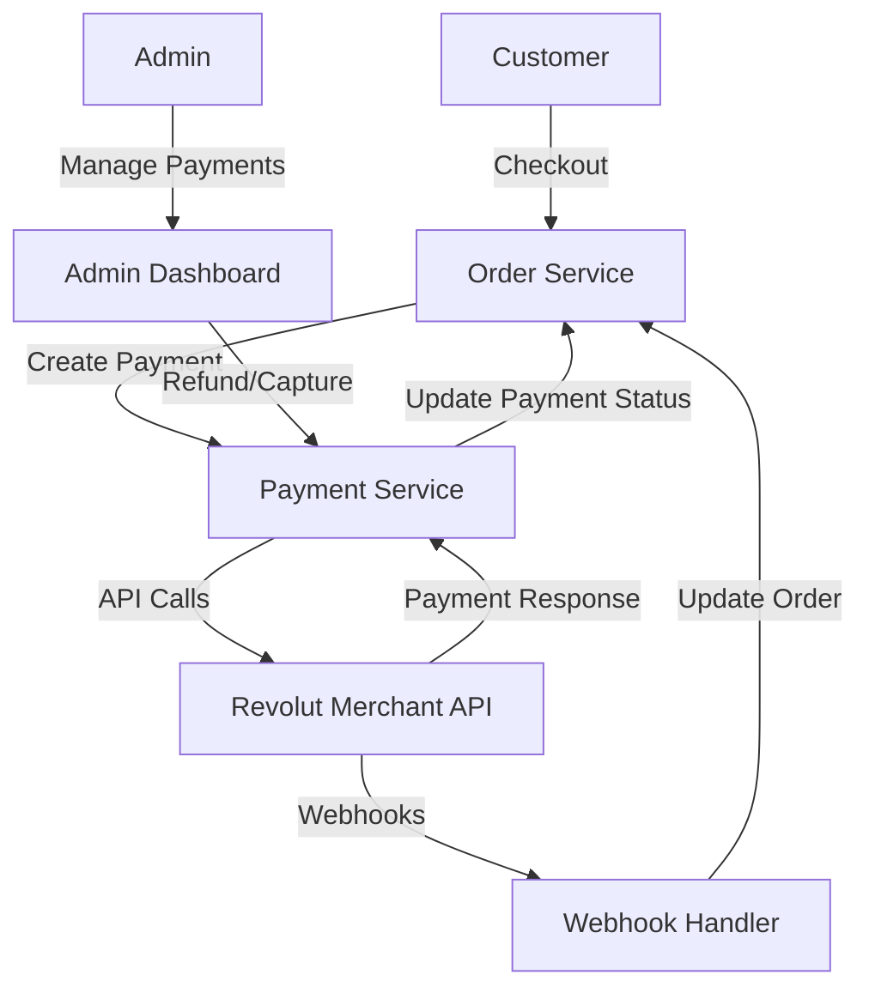
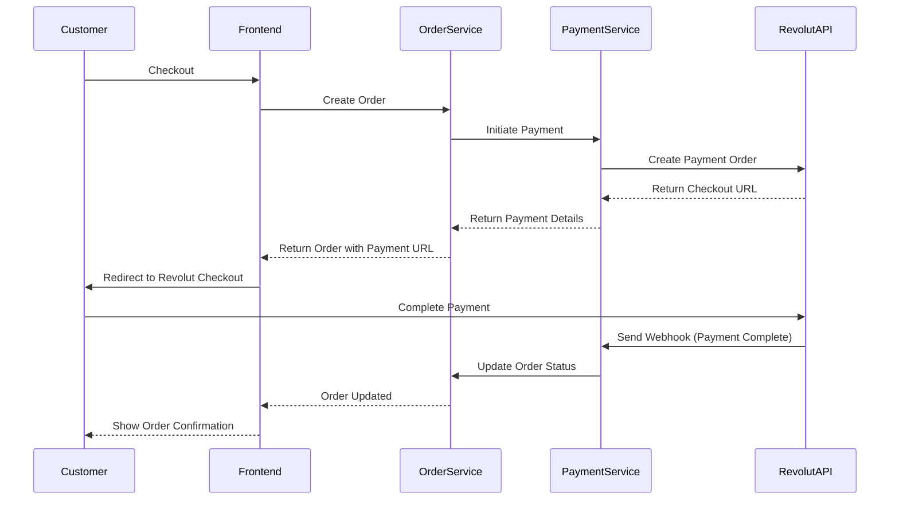
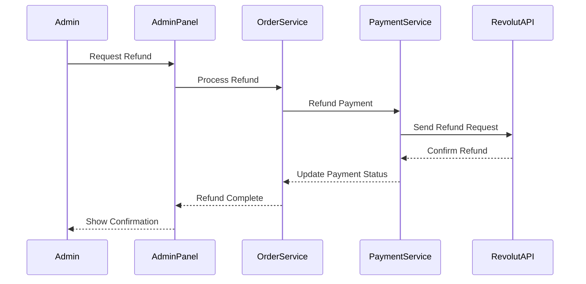

# Design Document: Revolut Merchant API Integration

## Overview

This design document outlines the integration of Revolut Merchant API into our e-commerce platform. The integration will provide a secure and efficient payment processing solution, replacing the current payment handling system. The design focuses on creating a modular payment service that interfaces with Revolut's API while maintaining compatibility with the existing order management system.

## Architecture

The integration will follow a service-oriented architecture pattern, with a dedicated payment service that encapsulates all Revolut API interactions. This approach ensures separation of concerns and allows for future payment provider changes with minimal impact on the rest of the system.



## Components and Interfaces

### 1. Payment Service

The core component responsible for all interactions with Revolut's API.

```go
// payment/revolut_service.go
type RevolutPaymentService struct {
    client        *revolut.Client
    db            *gorm.DB
    webhookSecret string
    apiKey        string
    baseURL       string
}

func NewRevolutPaymentService(db *gorm.DB, config *cfg.RevolutConfig) *RevolutPaymentService {
    // Initialize Revolut client with configuration
}

// Core payment operations
func (s *RevolutPaymentService) CreatePayment(orderID string, amount float64, currency string, customerInfo *CustomerInfo) (*PaymentResponse, error)
func (s *RevolutPaymentService) CapturePayment(paymentID string) error
func (s *RevolutPaymentService) RefundPayment(paymentID string, amount float64) error
func (s *RevolutPaymentService) GetPaymentStatus(paymentID string) (PaymentStatus, error)
func (s *RevolutPaymentService) HandleWebhook(payload []byte, signature string) error
```

### 2. Revolut Client

A wrapper around HTTP calls to Revolut's API endpoints.

```go
// payment/revolut/client.go
type Client struct {
    httpClient  *http.Client
    baseURL     string
    apiKey      string
    merchantID  string
}

func NewClient(baseURL, apiKey, merchantID string) *Client {
    // Initialize HTTP client with proper timeouts and settings
}

// API endpoint methods
func (c *Client) CreateOrder(req *OrderRequest) (*OrderResponse, error)
func (c *Client) GetOrder(orderID string) (*OrderResponse, error)
func (c *Client) RefundPayment(paymentID string, req *RefundRequest) (*RefundResponse, error)
func (c *Client) CapturePayment(paymentID string) (*CaptureResponse, error)
```

### 3. Payment Models

Data structures for payment processing.

```go
// models/payment.go
type Payment struct {
    gorm.Model
    OrderID           uint           `json:"order_id"`
    Order             Order          `json:"-"`
    RevolutOrderID    string         `json:"revolut_order_id"`
    RevolutPaymentID  string         `json:"revolut_payment_id"`
    Amount            float64        `json:"amount"`
    Currency          string         `json:"currency"`
    Status            PaymentStatus  `json:"status"`
    PaymentMethod     string         `json:"payment_method"`
    CustomerID        string         `json:"customer_id"`
    CheckoutURL       string         `json:"checkout_url"`
    CompletedAt       *time.Time     `json:"completed_at"`
    FailureReason     string         `json:"failure_reason"`
    RefundStatus      string         `json:"refund_status"`
    RefundedAmount    float64        `json:"refunded_amount"`
    Metadata          JSON           `json:"metadata"`
}

// JSON is a custom type for storing JSON data
type JSON map[string]interface{}
```

### 4. Webhook Handler

Component for processing Revolut webhook notifications.

```go
// handlers/payment/webhook.go
type WebhookHandler struct {
    paymentService *payment.RevolutPaymentService
    db             *gorm.DB
}

func (h *WebhookHandler) HandleWebhook(c *gin.Context) {
    // Validate webhook signature
    // Process webhook event
    // Update order status
}
```

### 5. Payment Controller

Handles payment-related HTTP requests.

```go
// handlers/payment/handler.go
type PaymentHandler struct {
    paymentService *payment.RevolutPaymentService
    db             *gorm.DB
}

func NewPaymentHandler(db *gorm.DB, paymentService *payment.RevolutPaymentService) *PaymentHandler {
    return &PaymentHandler{
        paymentService: paymentService,
        db:             db,
    }
}

// HTTP handlers
func (h *PaymentHandler) InitiatePayment(c *gin.Context)
func (h *PaymentHandler) GetPaymentStatus(c *gin.Context)
func (h *PaymentHandler) RefundPayment(c *gin.Context)
func (h *PaymentHandler) HandleWebhook(c *gin.Context)
```

## Data Models

### Extended Order Model

The existing Order model will be extended to include Revolut-specific payment information:

```go
// Additions to models/order.go
type Order struct {
    // Existing fields...
    
    // New fields for Revolut integration
    RevolutOrderID    string     `json:"revolut_order_id"`
    RevolutPaymentID  string     `json:"revolut_payment_id"`
    CheckoutURL       string     `json:"checkout_url"`
    PaymentProvider   string     `json:"payment_provider" gorm:"default:'revolut'"`
}
```

### Payment Configuration

Configuration for Revolut API credentials:

```go
// Addition to cfg/config.go
type RevolutConfig struct {
    APIKey        string
    MerchantID    string
    WebhookSecret string
    BaseURL       string // Different for sandbox and production
    IsSandbox     bool
}

// Update AppConfig
type AppConfig struct {
    // Existing fields...
    
    // Revolut configuration
    Revolut RevolutConfig
}
```

## Payment Flow

### Checkout Flow

1. Customer initiates checkout process
2. Order service creates a pending order
3. Payment service creates a payment order in Revolut
4. Customer is redirected to Revolut checkout page or shown embedded widget
5. Customer completes payment on Revolut's interface
6. Revolut sends webhook notification of payment completion
7. System updates order status based on webhook data



### Refund Flow

1. Admin initiates refund from admin panel
2. Payment service sends refund request to Revolut
3. Revolut processes refund and sends confirmation
4. System updates order payment status to refunded



## Error Handling

The integration will implement comprehensive error handling:

1. **API Communication Errors**
   - Implement retry logic for transient failures
   - Log detailed error information for debugging
   - Return appropriate error responses to clients

2. **Payment Processing Errors**
   - Handle declined payments gracefully
   - Provide clear error messages to customers
   - Maintain order in pending state to allow retry

3. **Webhook Processing Errors**
   - Validate webhook signatures to prevent fraud
   - Implement idempotency to prevent duplicate processing
   - Queue failed webhook processing for retry

4. **Reconciliation Errors**
   - Implement daily reconciliation job to detect discrepancies
   - Alert administrators of unresolved payment issues
   - Provide tools for manual intervention when needed

## Security Considerations

1. **API Authentication**
   - Secure storage of API keys and secrets
   - Use environment variables for sensitive configuration
   - Implement key rotation procedures

2. **PCI Compliance**
   - No storage of card details on our servers
   - Use Revolut's hosted checkout to minimize PCI scope
   - Regular security audits of payment flow

3. **Webhook Security**
   - Validate webhook signatures using Revolut's webhook secret
   - Implement IP whitelisting for webhook endpoints
   - Use HTTPS for all API communications

4. **Data Protection**
   - Encrypt sensitive payment data at rest
   - Implement proper access controls for payment information
   - Comply with relevant data protection regulations

## Testing Strategy

1. **Unit Testing**
   - Test payment service methods in isolation
   - Mock Revolut API responses for predictable testing
   - Test error handling and edge cases

2. **Integration Testing**
   - Test integration with Revolut's sandbox environment
   - Verify webhook processing with test events
   - Test payment lifecycle from creation to completion

3. **End-to-End Testing**
   - Test complete payment flows in sandbox environment
   - Verify order status updates after payment events
   - Test admin payment management functions

4. **Performance Testing**
   - Test system under high transaction volume
   - Verify webhook handler performance under load
   - Test database performance with payment queries

5. **Security Testing**
   - Verify API key security
   - Test webhook signature validation
   - Audit payment data access controls

## Monitoring and Analytics

1. **Payment Metrics**
   - Track payment success/failure rates
   - Monitor average payment processing time
   - Track payment method usage statistics

2. **System Health**
   - Monitor API response times
   - Track webhook processing success rates
   - Alert on payment processing failures

3. **Business Analytics**
   - Provide payment conversion funnel analysis
   - Track average order value by payment method
   - Analyze refund rates and reasons

## Implementation Considerations

1. **Phased Rollout**
   - Implement in sandbox environment first
   - Conduct beta testing with limited users
   - Gradually roll out to all customers

2. **Backward Compatibility**
   - Maintain support for existing payment references
   - Ensure order history remains consistent
   - Provide migration path for existing pending payments

3. **Documentation**
   - Create comprehensive API documentation
   - Document webhook payload formats
   - Provide troubleshooting guides for common issues

4. **Frontend Integration**
   - Provide React components for payment UI
   - Document frontend integration requirements
   - Create example implementation for developers